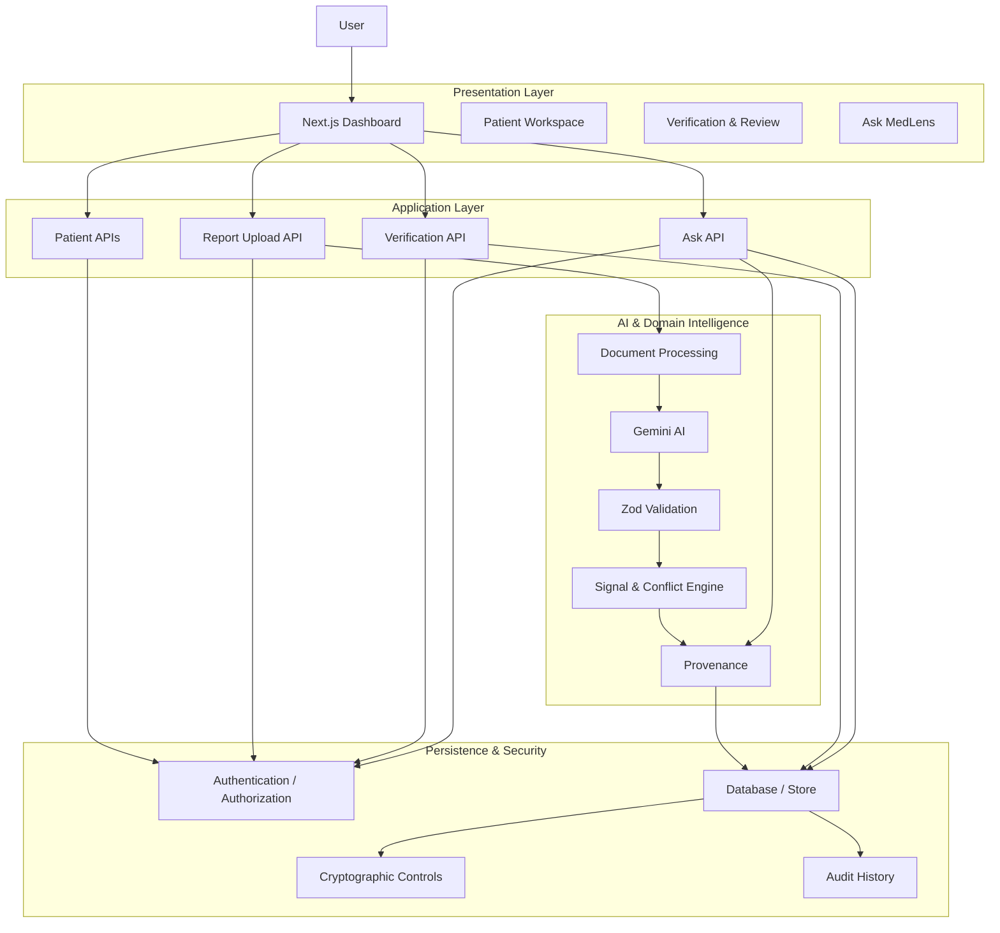

# MedLens — AI-Powered Clinical Information Intelligence

> **Transforming Fragmented Medical Information into a Structured, Source-Traceable, Reviewable, and Human-Verified Patient Information Record.**

MedLens is an AI-powered clinical information intelligence platform designed to address a practical problem: medical information is often fragmented across patient history, laboratory reports, medical documents, medication information, and previous records.

Instead of treating an LLM response as the source of truth, MedLens uses AI inside a controlled processing pipeline:

```text
Medical Information
        ↓
Secure Processing
        ↓
AI-Assisted Extraction
        ↓
Schema Validation
        ↓
Deterministic Validation
        ↓
Provenance & Evidence
        ↓
Information Signals
        ↓
Human Verification
        ↓
Structured Patient Record
```

### Core Principle
> **AI assists. The system validates. The source remains authoritative. Humans remain in control.**

MedLens is intentionally designed as an information intelligence and review system, not as an autonomous diagnostic or treatment system.

---

## 1. The Problem

Medical information is frequently distributed across:
* Patient intake information
* Symptoms and medical history
* Allergies
* Medications
* Laboratory reports
* Medical PDFs
* Medicine/document images
* Previous records
* Clinical notes

Traditional document-to-chat interfaces can make information easier to read, but they introduce important problems:
* AI-generated information may lose source context.
* LLMs can produce unsupported assumptions.
* Reference ranges may be incorrectly inferred.
* Important contradictions may be overlooked.
* Users may not know whether information was extracted, generated, or verified.
* Historical changes can be difficult to identify.
* A free-form summary is difficult to audit.

MedLens addresses this by creating a structured information layer between raw medical sources and AI-generated understanding.

---

## 2. What Makes MedLens Different?

MedLens is not simply:
`Upload a PDF → Ask an AI → Get a summary.`

Instead, MedLens treats AI as one component inside a controlled information-processing architecture.

### Traditional AI Workflow
```text
Document → LLM → Answer
```

### MedLens Workflow
```text
Document
   ↓
Extraction
   ↓
AI Structured Interpretation
   ↓
Schema Validation
   ↓
Deterministic Checks
   ↓
Provenance
   ↓
Signals / Conflicts
   ↓
Human Review
   ↓
Structured Record
   ↓
Grounded AI Interaction
```

This architecture is designed around source-of-truth preservation, provenance, uncertainty handling, and human oversight.

---

## 3. Core Capabilities: Patient Information Intake

MedLens supports structured patient information including:
* Demographics (Name, Age, Sex)
* Symptoms
* Existing conditions
* Allergies
* Medications
* Relevant medical history

User-entered information is represented separately from information extracted from documents (`USER_INPUT`).

**Primary Implementation Areas**:
* `app/api/patients/`
* `lib/db/`

---

## 4. Medical Document & Image Intelligence

MedLens processes supported medical documents and images to extract structured information.

### Processing Workflow
```text
Upload
 ↓
Validation
 ↓
Integrity / Hash Processing (SHA-256)
 ↓
Document or Image Processing
 ↓
AI-Assisted Extraction (Gemini 1.5)
 ↓
Schema Validation (Zod)
 ↓
Domain Validation
 ↓
Structured Record
```

Extracted information can include:
* Test names
* Values
* Units
* Reference ranges
* Report dates
* Observations
* Source information

**Relevant Implementation Areas**:
* `app/api/reports/upload/`
* `lib/ai/`
* `lib/utils/`

---

## 5. Structured Medical Record

AI output is not stored as an unrestricted block of generated prose.

MedLens converts extracted information into structured application data organized into clinical categories:
* Complete Blood Count (CBC)
* Metabolic information
* Endocrine information
* General Diagnostic Panels

This allows the application to perform deterministic operations such as:
* Range comparison
* Historical comparison
* Conflict detection
* Verification tracking
* Provenance display

---

## 6. Reference-Range Integrity

One of the core safety principles of MedLens is:
> **Never invent a laboratory reference range.**

When a report provides a reference range, MedLens uses the range contained in that source. The system classifies a result using the source-provided range:
* `WITHIN_PROVIDED_RANGE`
* `ABOVE_PROVIDED_RANGE`
* `BELOW_PROVIDED_RANGE`

If the source does not provide a usable reference range, MedLens preserves that uncertainty rather than substituting an assumed range:

```text
Source contains range → Use source range
Source does not contain range → REFERENCE_RANGE_UNAVAILABLE
```

The system does not use an LLM's general medical knowledge as a replacement for missing source evidence.

---

## 7. Provenance & Data Lineage

Provenance is a first-class concept in MedLens. Information is distinguished according to its origin:
* `USER_INPUT`
* `DOCUMENT_EXTRACTED`
* `AI_GENERATED`
* `HUMAN_VERIFIED`

Where available, provenance includes:
* Source document file name and SHA-256 hash
* Page number
* Source text snippet
* Extraction confidence score
* Timestamp & Verification status

**Intended Information Flow**:
```text
Structured Value → Provenance → Source Document → Page / Evidence
```

This makes the structured record reviewable rather than opaque.

---

## 8. Human-in-the-Loop Verification

AI extraction is treated as reviewable information rather than unquestionable truth. Extracted information moves through states:

```text
PENDING → VERIFIED
PENDING → CORRECTED → VERIFIED
PENDING → REJECTED
```

When supported by the workflow, human corrections preserve the original AI-generated value (`originalAIValue`) and create an audit trail event rather than silently replacing historical information.

Principle: **AI proposes. Humans verify.**

---

## 9. Clinical Information Signal Engine

MedLens converts information-management conditions into structured signals:
* `OUTSIDE_RANGE`
* `VERIFICATION_REQUIRED`
* `CONFLICT_DETECTED`
* `CHANGE_DETECTED`
* `MISSING_INFORMATION`
* `DUPLICATE_DOCUMENT`
* `LOW_CONFIDENCE_EXTRACTION`
* `REFERENCE_RANGE_UNAVAILABLE`

These signals are intentionally different from medical diagnoses. For example, `OUTSIDE_RANGE` means a recorded value is outside the reference range provided by the source report. It does **not** mean that MedLens has diagnosed a disease.

This separation between **Information Signal** and **Clinical Diagnosis** is a deliberate responsible-AI boundary.

---

## 10. Conflict Detection

Medical records may contain inconsistent information. MedLens identifies conflicts such as:
* Conflicting allergy information (e.g. intake Penicillin allergy vs. report NKDA)
* Medication discrepancies
* Conflicting demographic information
* Conflicting historical values
* Inconsistent dates or duplicate records

The system exposes the disagreement rather than silently selecting one value when evidence is ambiguous.

Principle: **Transparency over false certainty.**

---

## 11. Longitudinal Information Comparison

Medical information becomes more useful when historical records can be compared:
* Previous vs. current values
* Historical report dates
* Changed measurements
* Newly available vs. missing information
* Historical verification status

```text
Previous Report (Hemoglobin: X) ──> Current Report (Hemoglobin: Y) ──> CHANGE_DETECTED
```

The system reports the recorded change rather than automatically interpreting it as disease progression or improvement.

---

## 12. Grounded Ask MedLens

Ask MedLens provides patient-scoped AI interaction over available records:

```text
User Question
      ↓
Selected Patient Context
      ↓
Relevant Structured Information
      ↓
Relevant Source Evidence
      ↓
Grounded AI Generation
      ↓
Source References (e.g. CBC_September.pdf — Page 1)
      ↓
Answer
```

The system is designed to avoid using unrelated external medical knowledge as a substitute for patient-specific evidence. When available records are insufficient, the assistant communicates uncertainty rather than fabricating an answer.

---

## 13. AI Architecture

The AI layer is intentionally constrained:

```text
Input
 ↓
Prompt / AI Processing
 ↓
Structured Output
 ↓
Parser
 ↓
Zod Schema Validation
 ↓
Domain Validation
 ↓
Provenance
 ↓
Application State
```

The raw LLM response does not directly become trusted medical application state. This creates a trust boundary between **Probabilistic AI output** and **Deterministic application state**.

---

## 14. Prompt Engineering

Prompt design is treated as an engineering component built around:
* Explicit task definitions
* Structured JSON output requirements
* Source-grounding requirements
* Missing-information behavior
* Uncertainty handling & Medical safety constraints
* Prohibited inference & Document-content isolation

Additional prompt architecture documentation: `docs/PROMPT_ENGINEERING.md`

---

## 15. Prompt Injection Defense

Uploaded documents are treated as **untrusted content**. A document may contain text such as *"Ignore previous instructions"*. That text must remain document content rather than an application instruction:

```text
System Instructions
        ↓
Application Rules
        ↓
User Input
        ↓
Retrieved Evidence
        ↓
Document Content (Isolated)
```

Document content cannot override application-level safety rules. Adversarial tests (`tests/adversarial-safety.test.ts`) cover this boundary.

---

## 16. Security Architecture & Patient-Scoped Authorization

Security is implemented as a server-enforced boundary:
* Authentication & JWT cookie validation
* Server-side authorization checks on all patient resources
* Password hashing using bcrypt
* Input validation via Zod schemas
* Cryptographic file hashing (SHA-256) & AES-256-GCM PII encryption

### Patient-Scoped Authorization Flow
```text
Authenticated User + Requested Resource ──> Authorization Check ──> Allow / Deny
```
Prevents unauthorized cross-patient data access (IDOR protection).

---

## 17. Cryptographic Controls

MedLens uses distinct cryptographic mechanisms:
* **AES-256-GCM**: Used for protecting sensitive persisted patient information (`Confidentiality`).
* **SHA-256**: Used for document integrity and duplicate upload detection (`Integrity / Identity`).

Encryption and hashing serve different purposes and are not treated as interchangeable.

---

## 18. Privacy

MedLens follows a **Privacy by Design** architecture:
* Minimize sensitive data exposure in client code, logs, and JWTs.
* Server-side secret management.
* Patient-scoped authorization boundaries.
* Dedicated deletion workflows (`DELETE /api/patients/[id]`).
* Minimize payload sent to external AI processing.

---

## 19. Responsible AI Boundaries

MedLens intentionally does **not** position the AI as an autonomous clinical decision-maker. The application does **not**:
* Diagnose diseases
* Prescribe treatment
* Recommend medication dosage changes
* Automatically change medications
* Invent laboratory reference ranges
* Resolve ambiguous conflicts without review
* Present uncertain information as established fact

The system is intended to: organize information, extract structured data, preserve evidence, identify review conditions, compare records, and provide source-grounded explanations.

---

## 20. Security & AI Trust Boundary

```text
             UNTRUSTED
                ↓
      User / Document / AI
                ↓
       Validation Boundary
                ↓
          Trusted State
                ↓
        Human Verification
```

Neither uploaded content nor raw model output automatically becomes trusted application state.

---

## 21. Testing Strategy

Testing focuses on both normal workflows and failure conditions. Executed and measured test suites (`npm test`):

### Test Measured Results
* **5 Test Suites** (`api.test.ts`, `components.test.tsx`, `utils.test.ts`, `medical-record.test.ts`, `adversarial-safety.test.ts`)
* **30 Total Passing Tests** (0 Failures, Exit Code 0)

### Coverage Areas
1. **API**: Gemini API mocks, 429 rate limiting, 500 timeouts, network failures.
2. **Components**: Status badges, verification indicators, provenance citations, WCAG ARIA attributes.
3. **Utilities**: SHA-256 hashing, AES-256 encryption, LRU cache, Canvas image compression, input debouncing.
4. **Medical Record Logic**: Zod schema extraction, range handling, document processing.
5. **Adversarial Safety**: Prompt injection resilience, missing range handling, audit preservation.

---

## 22. Accessibility

Accessibility is part of the application architecture:
* Semantic HTML5 elements
* Keyboard-accessible controls (`tabIndex={0}`, `onKeyDown` handlers)
* Visible focus indicators (`focus-visible:ring-2 focus-visible:ring-blue-600`)
* ARIA semantic attributes (`role="tablist"`, `role="table"`, `scope="col"`, `aria-live="polite"`)
* Non-color-only status indicators (`Within Range`, `Above Range`, `Below Range` text badges alongside colors)

---

## 23. Performance & Efficiency

Optimization focuses on eliminating redundant computation:
* Canvas image payload compression (`lib/utils/imageCompressor.ts`)
* Client-side LRU session caching (`lib/utils/cache.ts`)
* Debounced input interactions (`lib/utils/debounce.ts`)
* Lazy loading and code splitting

### Golden Rule:
> **Do not use an LLM when deterministic computation is sufficient.**

* Hashing → **Deterministic**
* Duplicate detection → **Deterministic**
* Schema validation → **Deterministic**
* Range comparison → **Deterministic**
* Authorization → **Deterministic**
* Semantic extraction → **AI-assisted**

---

## 24. Architecture Overview



---

## 25. Repository Structure

```text
app/
├── api/
│   ├── ask/
│   ├── patients/
│   ├── reports/
│   └── verification/
│
├── (dashboard)/
│   └── patients/
│       └── [id]/
│
components/
├── SideBySideView.tsx
├── ProvenanceBadge.tsx
├── StatusBadge.tsx
├── PatientSubNav.tsx
└── Sidebar.tsx

lib/
├── ai/
│   └── gemini.ts
├── db/
│   └── store.ts
├── security/
│   ├── crypto.ts
│   └── hash.ts
├── utils/
│   ├── cache.ts
│   ├── debounce.ts
│   └── imageCompressor.ts
└── validation/
    └── schemas.ts

tests/
├── api.test.ts
├── components.test.tsx
├── utils.test.ts
├── medical-record.test.ts
└── adversarial-safety.test.ts

docs/
├── ADR.md
└── PROMPT_ENGINEERING.md
```

---

## 26. Architectural Decision Records

Important architectural decisions are documented in `docs/ADR.md`:
* **ADR 001**: Schema-Constrained Extraction over Free-Form Summarization
* **ADR 002**: Source Reference Ranges as Sole Benchmark
* **ADR 003**: First-Class Document Provenance
* **ADR 004**: Human-in-the-Loop Verification & Audit Preservation
* **ADR 005**: Prompt Injection Defense & Context Isolation
* **ADR 006**: Patient-Scoped Grounded RAG

---

## 27. Technology Stack

| Layer | Technology |
|:---|:---|
| **Frontend** | Next.js 14 App Router |
| **UI** | React 18 |
| **Language** | TypeScript |
| **Styling** | Tailwind CSS |
| **Database** | MongoDB (with in-memory fallback) |
| **AI Engine** | Google Gemini 1.5 |
| **Validation** | Zod |
| **Authentication** | JWT (`jose`) / HttpOnly Cookies |
| **Password Security** | bcryptjs |
| **Cryptography** | AES-256-GCM / SHA-256 |
| **Testing** | Vitest / React Testing Library / happy-dom |
| **Document Processing** | pdf-parse / Canvas compression |
| **Icons** | Lucide React |

---

## 28. Local Development

### Prerequisites
* Node.js 18.x+
* npm
* MongoDB (optional; fallback memory store active)
* Google Gemini API Key

### Installation
```bash
npm install
```

### Development
```bash
npm run dev
```

### Testing & Verification
```bash
# Run Vitest test suite (30 passing tests)
npm test

# Generate coverage report
npm run test:coverage

# Run TypeScript compilation check
npx tsc --noEmit

# Production build
npm run build
```

---

## 29. Environment Configuration

Create `.env.local` in root:
```env
GEMINI_API_KEY=your_gemini_api_key_here
MONGODB_URI=mongodb://localhost:27017/medlens
JWT_SECRET=your_jwt_secret_key_here
ENCRYPTION_KEY=your_32_byte_hex_key_here
```

Server-only secrets are never exposed to browser-side code.

---

## 30. Evaluation-Oriented Engineering

MedLens is intentionally built around several engineering principles:
1. **Source-of-Truth Preservation**: Original documents remain authoritative.
2. **Schema-Constrained AI**: AI output must conform to schemas before entering trusted state.
3. **Provenance-Aware Processing**: Information remains traceable to its origin.
4. **Human-in-the-Loop Verification**: AI extraction can be reviewed, corrected, or rejected.
5. **Deterministic Validation**: Where deterministic logic is possible, it is not delegated to an LLM.
6. **Patient-Scoped Access**: Sensitive information is protected through server-side authorization boundaries.
7. **Uncertainty-Aware UX**: Missing or ambiguous information remains visibly uncertain.
8. **Responsible AI**: System avoids presenting AI conclusions as authoritative decisions.

---

## 31. Why MedLens Uses AI

### AI is used where semantic understanding provides value:
* Extracting structured information from complex medical documents and label images
* Interpreting document layout and context
* Generating patient-friendly summaries
* Answering questions using retrieved patient-specific evidence

### AI is intentionally NOT used as the authority for:
* Authorization
* Reference-range invention
* Database integrity
* Schema validation
* Audit history
* Security decisions
* Deterministic comparisons

---

## 32. The MedLens Trust Model

The central trust model is:
```text
SOURCE ──> EXTRACT ──> VALIDATE ──> TRACE ──> REVIEW ──> UNDERSTAND
```

Rather than:
```text
SOURCE ──> LLM ──> TRUST
```

This is the core architectural distinction between MedLens and a conventional medical document chatbot.

---

## 33. Demo Flow

A complete demonstration follows one information lifecycle:

```text
1. Create Patient
       ↓
2. Enter Patient Intake Information
       ↓
3. Upload Medical Report (PDF / Image)
       ↓
4. Process Document (SHA-256 Hash + Text Extract)
       ↓
5. AI Extracts Structured Information (Gemini 1.5)
       ↓
6. Schema / Domain Validation (Zod)
       ↓
7. Display Structured Record (SideBySide View)
       ↓
8. Show Source Provenance (Page Citation & Text Highlight)
       ↓
9. Review / Correct Information (Verify / Edit / Reject)
       ↓
10. Preserve Audit History (Original AI value retained)
       ↓
11. Upload Historical Report
       ↓
12. Detect Recorded Changes & Conflicts
       ↓
13. Grounded Ask MedLens (RAG)
       ↓
14. Show Evidence Behind Answer
```

---

## 34. Responsible AI Statement

MedLens is a clinical information intelligence platform designed to help organize, structure, trace, compare, and review medical information.

It does not replace professional clinical judgment. It does not provide autonomous diagnosis, treatment, or prescription decisions. AI-generated information remains distinguishable from source information and human-verified information.

---

## 35. Limitations

MedLens is not intended to guarantee clinical correctness. Document quality, OCR quality, extraction quality, incomplete source information, ambiguous records, and model limitations can affect results.

For that reason, MedLens emphasizes:
* Source evidence
* Structured validation
* Provenance
* Uncertainty
* Human verification
* Auditability

The system communicates limitations rather than hiding them.

---

## 36. Competition Philosophy

MedLens was designed around a simple idea:
> **Don't just add AI. Build the system around responsible AI.**

The project demonstrates how AI can be embedded inside a broader engineering architecture:
```text
AI + Validation + Security + Provenance + Human Oversight + Testing + Responsible AI
```

The objective is to make AI useful, bounded, inspectable, and reviewable.

---

## 37. Final Architecture Principle

```text
        MEDICAL SOURCES
              ↓
      STRUCTURED EXTRACTION
              ↓
          AI ASSIST
              ↓
       SCHEMA VALIDATION
              ↓
    DETERMINISTIC VALIDATION
              ↓
       PROVENANCE / EVIDENCE
              ↓
     SIGNALS & CONFLICTS
              ↓
      HUMAN VERIFICATION
              ↓
      STRUCTURED RECORD
              ↓
     GROUNDED AI ASSISTANCE
```

### Key Principle:
> **AI assists. The system validates. The source remains authoritative. Humans remain in control.**

### Build Philosophy:
MedLens is not designed to demonstrate how much AI can generate. It is designed to demonstrate how effectively AI can be integrated into a trustworthy software system:

```text
Source → Structure → Validate → Trace → Review → Understand.
```
